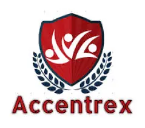

<p align="center">
  
</p>

<h1 align="center">Accentrex</h1>

<p align="center">
  <strong>International Migration & Visa Consultancy Landing Page</strong>
</p>

<p align="center">
  <a href="https://accentrex-web.vercel.app/">Live Demo</a>
</p>

---

## About

Landing page implementation for the **Accentrex** website — an international migration and visa consultancy service. The site enables appointment scheduling and presents the company's services to prospective clients seeking migration to **Australia**, **New Zealand**, and **Canada** through the _Study, Live, and Migrate_ program.

> This project was developed as part of my **On-the-Job Training (OJT)** at **NexusCloud I.T. Solutions**.

---

## Features

- **Animated Hero Section** — Dynamic image grid with shuffle animation and a typewriter text effect
- **Smooth Section Navigation** — Hash-based scrolling between Home, About, Programs, and Contact sections
- **Service Cards** — Visa application, migration options, consultation, and work & study programs
- **Inquiry Form** — Multi-step appointment scheduler with:
  - Email verification via one-time code
  - Google reCAPTCHA v2 integration
  - Weekday-only date selection
  - Google Apps Script backend submission
- **Responsive Design** — Fully responsive layout with mobile hamburger menu
- **Framer Motion Animations** — Entrance animations, hover effects, and spring transitions throughout
- **Embedded Google Maps** — Office location displayed via interactive map
- **Social Media Links** — Facebook, Instagram, TikTok, YouTube, and email
- **Lazy Loading** — Code-split routes and components for faster initial load

---

## Tech Stack

| Category        | Technology                                                      |
| --------------- | --------------------------------------------------------------- |
| **Framework**   | [React 19](https://react.dev/) + [Vite 6](https://vite.dev/)   |
| **Styling**     | [Tailwind CSS 4](https://tailwindcss.com/)                      |
| **UI Library**  | [shadcn/ui](https://ui.shadcn.com/) (New York style)            |
| **Animations**  | [Framer Motion](https://www.framer.com/motion/)                 |
| **Routing**     | [React Router DOM v7](https://reactrouter.com/)                 |
| **Forms**       | [React Hook Form](https://react-hook-form.com/) + [Zod](https://zod.dev/) |
| **Icons**       | [Lucide React](https://lucide.dev/) + [React Icons](https://react-icons.github.io/react-icons/) |
| **Captcha**     | [react-google-recaptcha](https://github.com/dozoisch/react-google-recaptcha) |
| **Date Utils**  | [date-fns](https://date-fns.org/)                               |
| **Toasts**      | [Sonner](https://sonner.emilkowal.dev/)                         |
| **Deployment**  | [Vercel](https://vercel.com/)                                   |

---

## Project Structure

```
AccentrexWeb/
├── public/
│   └── vite.svg                    # Default Vite favicon
├── src/
│   ├── assets/                     # Static images & icons
│   │   ├── img1.webp               # Hero/gallery image
│   │   ├── img2.webp               # Accentrex logo
│   │   ├── img3.webp               # Hero/gallery image
│   │   ├── img4.webp               # Hero/gallery image
│   │   ├── img5.webp               # Hero/gallery image
│   │   └── react.svg               # React logo
│   ├── components/
│   │   ├── ui/                     # shadcn/ui primitives
│   │   │   ├── button.jsx
│   │   │   ├── calendar.jsx
│   │   │   ├── card.jsx
│   │   │   ├── carousel.jsx
│   │   │   ├── form.jsx
│   │   │   ├── input.jsx
│   │   │   ├── label.jsx
│   │   │   ├── navigation-menu.jsx
│   │   │   ├── popover.jsx
│   │   │   ├── sonner.jsx
│   │   │   ├── textarea.jsx
│   │   │   └── tooltip.jsx
│   │   ├── About.jsx               # About, Mission, Values & Why Choose Us
│   │   ├── CardComponent.jsx        # Reusable program/service card
│   │   ├── Contacts.jsx             # Contact info, map & social links
│   │   ├── Footer.jsx               # Site footer with copyright
│   │   ├── FormComponent.jsx        # Inquiry scheduling form
│   │   ├── HomeSection.jsx          # Hero section with image grid
│   │   ├── Navbar.jsx               # Responsive navigation bar
│   │   ├── Programs.jsx             # Services offered section
│   │   └── Typewriter.jsx           # Typewriter text animation
│   ├── Layout/
│   │   └── MainLayout.jsx           # App shell (Navbar + Outlet + Footer)
│   ├── lib/
│   │   └── utils.js                 # Utility functions (cn helper)
│   ├── pages/
│   │   └── Inquiry.jsx              # Inquiry form page
│   ├── App.jsx                      # Root component with routing
│   ├── index.css                    # Global styles & Tailwind config
│   └── main.jsx                     # Application entry point
├── .gitignore
├── components.json                  # shadcn/ui configuration
├── eslint.config.js                 # ESLint config
├── index.html                       # HTML entry point
├── jsconfig.json                    # Path alias config
├── package.json                     # Dependencies & scripts
├── vercel.json                      # Vercel SPA rewrite rules
└── vite.config.js                   # Vite + Tailwind + path aliases
```

---

## Getting Started

### Prerequisites

- [Node.js](https://nodejs.org/) (v18+)
- [npm](https://www.npmjs.com/) or [yarn](https://yarnpkg.com/)

### Installation

```bash
# Clone the repository
git clone https://github.com/<your-username>/AccentrexWeb.git
cd AccentrexWeb

# Install dependencies
npm install
```

### Environment Variables

Create a `.env` file in the project root with the following variables:

```env
VITE_GOOGLE_SCRIPT_URL=<your-google-apps-script-web-app-url>
VITE_RECAPTCHA_SITE_KEY=<your-google-recaptcha-v2-site-key>
```

| Variable                  | Description                                            |
| ------------------------- | ------------------------------------------------------ |
| `VITE_GOOGLE_SCRIPT_URL`  | Deployed Google Apps Script URL for form submissions    |
| `VITE_RECAPTCHA_SITE_KEY` | Google reCAPTCHA v2 site key for bot protection         |

### Development

```bash
npm run dev
```

The app will be available at `http://localhost:5173`.

### Build

```bash
npm run build
```

### Preview Production Build

```bash
npm run preview
```

### Lint

```bash
npm run lint
```

---

## Deployment

This project is deployed on **Vercel** with SPA rewrites configured in [`vercel.json`](./vercel.json). Any push to the main branch triggers an automatic deployment.

---

## License

© 2026 Accentrex. All rights reserved.
